. 

**Table of Contents**  

1. **Project Definition****     
1. Project Name 
1. Project Overview 
1. Application 
1. Joystick and Throttle Control 
1. Head Tracker Integration 
1. Control with Physical Interface 
1. The Mission Environment 
1. Overcoming Challenges 
2. **Hardware and Software****     
1. Hardware Components 
   1. Flight Control Interface 
   1. Head Tracking System 
1. Software Components 
1. Integration and Functionality 
3. **System Architecture and Synchronization**     
   1. System Architecture Overview**  
   1. Synchronization Between Subsystems 
   1. VR and Real-World Feedback Loop 
4. **Modules****     
   1. Module 1 : Hardware Systems
1. Flight Controller Hardware   
1. ESP32 Firmware & Communication 
1. Hardware ↔ Game Engine Integration 
2. Module 2 : Virtrual Simulation Systems
1. Aircraft Physics Engine 
1. Multiplayer System 
1. VR Cockpit and Head Tracker 
1. AI Dogfight System 
1. Environment & Map System 
5. **Detailed Implementation****     
1. ESP32 Firmware Structure 
1. Unreal Engine Integration (C++ + Blueprints) 
1. Multiplayer Implementation 
6. **The Games****     
1. Single Player Scenario: AI Dogfight 
1. Multiplayer Dogfight 
1. Mission Types 
1. Map & Optimization System 
1. User Interface and Feedback 

**7.The Games**     

1. Hardware Communication Testing 
1. Flight Physics Testing 
1. AI Behavior Testing 
1. Multiplayer Testing 
1. Map & FPS Optimization 
1. User Feedback  
1. **Project Name** 

**FlightVR: Realistic Combat Flight Simulation 1.1.2 Project Overview** 

**T**he FlightVR project is a comprehensive flight simulation system that aims to deliver a realistic and immersive combat flying experience. Developed using Unreal Engine 5.2, the project integrates custom-built hardware modules, such as ESP32-based joystick systems, physical throttle controls, and a VR cockpit system with real-time head tracking.     

**Key features include:** 

- Custom-written flight physics system with real-time response and smooth control    
- Multiplayer dogfight scenarios using Unreal Engine’s built-in networking architecture    
- AI-controlled opponents with collision-safe tracking and continuous projectile logic    
- Mobile-based VR cockpit experience with real-time head tracking via IMU sensors    
- Manually designed, performance-optimized maps with high-FPS terrain and no unnecessary visual clutter.    

**The simulator offers both technical depth and interactive engagement, targeting both hobbyist flight sim players and academic demonstrations of real-time simulation and control systems.**     

2. **Application**     
1. **Joystick and Throttle Control**     

The core input method for our flight simulation environment is a custom-built joystick and throttle system, powered by ESP32 and Arduino-compatible modules. These controls provide a highly realistic and tactile piloting experience.     

**The XY joystick module is responsible for handling pitch and roll inputs.**     

- A potentiometer simulates throttle control, offering fine-grained management of engine power.     
- These inputs are transmitted to the simulation environment through the ESP32 and processed in real-time by the flight controller software.     

**This setup allows users to directly interact with the aircraft's control surfaces, providing smooth and responsive behavior that mirrors real-world flying.**     

2. **Head Tracker Integration**     

**To enhance immersion, the project includes a VR head tracking system. Using sensors such as MPU6050 mounted on a headset or a mobile phone’s IMU, the pilot’s head movements are captured and mapped into the cockpit view. This** 

**feature enables players to:** 

- Look around inside the cockpit     
- Track enemy aircraft during dogfights     
- Enhance spatial awareness during complex maneuvers     

**The head tracker data is streamed via Wi-Fi or USB using UDP or serial communication, and is interpreted within Unreal Engine 5 to adjust the in-game camera dynamically.**     

3. **Control with Physical Interface**     

All hardware inputs are processed by ESP32 and communicated to the simulation software layer via serial or wireless channels. Unlike traditional keyboard or mouse controls, this physical interface significantly enhances realism and makes player interaction more engaging and lifelike.     

4. **The Mission Environment**     

**The simulation includes several carefully crafted maps built using Unreal Engine’s landscape and sky systems. These environments range from:**     

- Open skies and mountainous terrain     
- Combat zones with AI-controlled enemy jets     
- Airports and checkpoints for takeoff and landing **The simulation supports:** 
- Multiplayer dogfight scenarios, where players engage in competitive aerial combat     
- Single-player AI missions, in which enemy aircraft respond to the player’s movements and strategies     

**Each environment is enhanced with realistic lighting, weather conditions, and altitude-based atmospheric effects.**     

5. **Overcoming Challenges**     

**Throughout development, the team encountered and overcame several key challenges:**     

- Synchronizing physical hardware with in-game dynamics (e.g., joystick drift, throttle calibration)     
- Ensuring low-latency VR tracking for accurate head movement representation     
- Stabilizing multiplayer session handling, especially during high-speed combat scenarios     

**Through collaborative effort and iterative testing, these obstacles were addressed to deliver a smooth, high-fidelity flight simulation experience.**     

**2. Hardware and Software**  

1. **Hardware Components**      
1. **Flight Control Interface**     **ESP32 Microcontroller**     

**Description**: A microcontroller board based on the ATmega328P.     

**Purpose:** Serves as the central processing unit for reading analog and digital input from the joystick and potentiometer. Transmits real-time control data to the simulation via USB serial or wireless communication.     

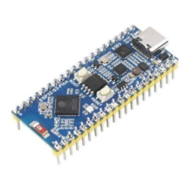

**Potentiometer**     

**Description:** A variable resistor that changes voltage output based on rotation.     

**Purpose:** Simulates **throttle control** in the aircraft, allowing players to increase or decrease engine power smoothly. The voltage values are read by the ESP32 and mapped to throttle values in the simulator.                        

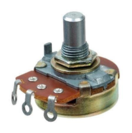

**XY Joystick Module (Arduino-Compatible)**     

**Description: A two-axis analog joystick module with an optional push button.**     

**Purpose:** Captures pitch and roll inputs from the user. These values are translated into aircraft movement commands and passed into the game engine via the ESP32.     

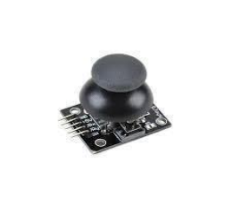

2. **Head Tracking System**     

` `**MPU6050 Sensor**     

**Description:** A 6-axis Inertial Measurement Unit (IMU) combining a 3-axis 

gyroscope and a 3-axis accelerometer.     

**Purpose:** Detects head orientation and movement in real-time. Mounted to a headset or mobile phone, the sensor data is streamed to the PC and used to update the in-game camera, enabling a fully immersive VR cockpit experience.**     

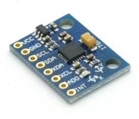

**Connection Layout Summary**     

- All hardware modules are wired into the ESP32’s analog and digital input pins.     
- Data from the joystick and potentiometer is mapped to control surfaces like aileron, 

  elevator, and engine throttle.     

- The MPU6050 provides pitch, yaw, and roll data for dynamic camera control.     
- ESP32 communicates with the Unreal Engine simulation either through a serial 

  port or UDP socket.     

2. **Software Components**      
- **C/C++**      
- **Description**: Programming languages used for developing the software components of the project.
- **Purpose**: Develops firmware for reading sensor data and handling communication, as well as creating the simulation environment.
- **Unreal Engine 5**
- **Description**: A powerful game engine that easy to integrate with C++ languages and known for advanced graphics and physics capabilities.
- **Purpose**: Used to create the VR simulation environment, including the menu and the game.     
3. **Integration and Functionality**      

The integration of hardware and software components was carefully structured to create a seamless and interactive flight simulation system. Each module was designed to operate independently while maintaining synchronized communication across the full architecture.     

**3.1 System Architecture Overview**     

- The **ESP32 microcontroller** reads hardware inputs (joystick, potentiometer, and MPU6050 sensor) and sends them as structured data packets to the PC.     
- A **custom interface in Unreal Engine 5.2** receives this data via serial or UDP communication.     
- Unreal’s simulation logic then applies these values to:     
- Control surfaces (pitch, roll, throttle)  o Incockpit 

camera (via head tracking)   o Dynamic UI 

components (speed, altitude, attitude  indicators)     

All components function in real time, providing low-latency feedback for a responsive flight experience.     

By combining these technologies, we have created an immersive and interactive VR experience  that  showcases  the  capabilities  of  our  VR  glove  in  various  scenarios, including object interaction in the Hub and gameplay in the Bowling and Space Invader games. This comprehensive integration highlights the potential of VR technology in providing engaging and intuitive user experiences      

3. **Synchronization Between Subsystems**     
- These results are mapped onto the Unreal Engine aircraft model to maintain visual and physical consistency.     
- Multiplayer sync is achieved through **UE’s replication system**, while head tracking and cockpit controls are updated locally for performance.     
4. **- VR and Real-World Feedback Loop**     
- The VR headset, implemented using a smartphone with the iVRy mobile application, captures yaw, pitch, and roll using the phone's built-in IMU sensors.     
- This orientation data is streamed in real-time to Unreal Engine’s VR camera system via the iVRy desktop driver.     
- The cockpit camera dynamically adjusts based on head movements, providing a responsive and immersive visual experience.     
- All rotational inputs are processed within a calibrated range to ensure natural and smooth transitions, minimizing motion sickness and input lag.     

**4. Modules**     

**4.1 Module 1 : Hardware Systems**    

1. **Flight Controller Hardware**     

**This module consists of the joystick and throttle input system, implemented using ESP32 and analog hardware components.**     

- The joystick provides pitch and roll data, while a potentiometer controls the throttle.     
- Signals are read via ESP32's analog input pins and normalized.     
- Filtered input values are transmitted to Unreal Engine via serial or Wi-Fi.    The system allows players to maneuver the aircraft intuitively with real hardware, enhancing immersion and realism.    
2. **ESP32 Firmware & Communication**   

Custom firmware running on the ESP32 processes hardware inputs and transmits data to the simulation engine.   

- **Setup Phase:** Configures pin modes and initializes Serial or Wi-Fi communication.   
- **Loop Logic:** Continuously reads joystick, throttle, and IMU values.   
- **Data Formatting:** Packages data into formatted strings (e.g., PITCH:23;ROLL:-12;THROTTLE:80;YAW:5).   
- **Transmission:** Sends data via Serial (USB) or UDP (Wi-Fi) to Unreal Engine in real time.   
3. **Hardware ↔ Game Engine Integration**   

**Integration with Unreal Engine ensures that physical inputs are reflected ingame with minimal delay.** 

- Unreal-side modules (via Blueprints or C++) listen for incoming control data.   
- Joystick & Throttle: Affect aircraft orientation and engine power through 

  Unreal’s physics system.   

- Head Tracking Data: Updates camera transform values to reflect the player’s realworld head movements.   
- This allows for synchronized, immersive control between the real and virtual systems.   

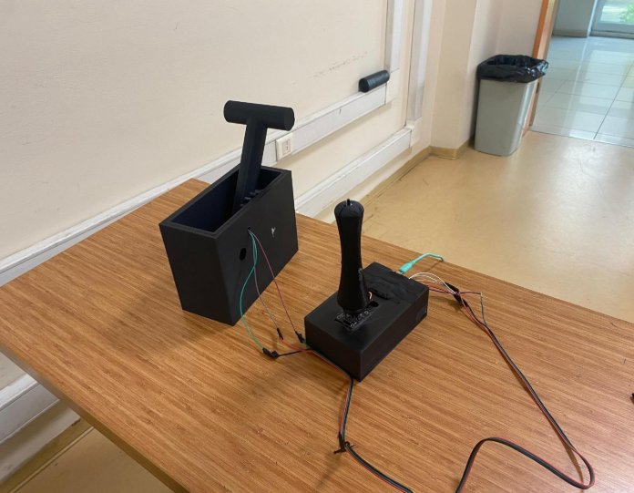

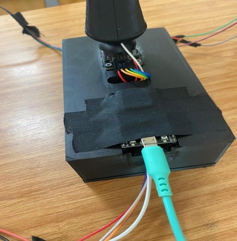

**4. Module 2 : Virtrual Simulation Systems**

1. **Aircraft Physics Engine**     

**Unlike other simulators, we did not use JSBSim. All flight physics were implemented from scratch using Unreal Engine 5.2 with C++ and Blueprints.**     

- Lift, drag, and torque forces were manually calculated.     
- Unreal’s AddForce() and AddTorque() methods were used to apply physics to the aircraft.     
- Flight dynamics like stall, speed caps, and control delay were tuned for realism and fun.     
- All development and testing were done on Windows.     

**This custom physics system gave us full control and allowed smoother integration with other gameplay elements.**    

2. **Multiplayer System**     

**The multiplayer system was implemented using Unreal Engine’s native networking tools without EOS.**     

- A basic client-server architecture was used to replicate aircraft positions, inputs, and firing actions.     
- Each player’s hardware inputs (joystick, throttle, etc.) are processed locally and synced to other clients.     
- Dogfight mechanics include projectile replication, collision handling, and basic synchronization.     
- Lightweight replication methods were applied to reduce lag and maintain 

  smooth gameplay.     

3. **VR Cockpit and Head Tracker**     

**This module delivers a highly immersive virtual cockpit experience by leveraging mobile-based head tracking via the iVRy system.**     

- A smartphone acts as the VR headset, using its onboard gyroscope and accelerometer to capture head rotation (pitch, yaw, roll).     
- The orientation data is transmitted in real-time through iVRy’s streaming pipeline, bypassing the need for external IMU sensors like MPU6050.     
- Within Unreal Engine 5.2, this data updates the cockpit camera transform on every simulation tick.     
- This system allows the player to naturally look around the cockpit, track targets, and enhance spatial awareness during flight, all without requiring dedicated VR hardware.     

  

4. **AI Dogfight System**        

**An AI system was developed to enable single-player combat engagements.** 

**Instead of relying on Unreal's standard Behavior Tree system, custom logic was implemented using Blueprints and C++ to ensure precise control and predictable behavior.**    

- **Collision Management:** To prevent mid-air collisions, a Capsule Collision component was introduced. Instead of locking AI targeting to the player’s mesh, calculations and pathing were directed to this collision capsule, which is positioned dynamically at a precomputed offset.     
- **Optimized Targeting Logic:** o AI constantly orbits around the player. o  Shot direction is randomized slightly to simulate dynamic combat behavior rather than 

  direct constant hits.    

- This creates more engaging and less predictable gameplay.     
- **Flight Parameters:** 
- Speed, max acceleration, collision bounds, and projectile velocity were carefully tuned.    
- All calculations were handled within the BP\_FlyingAI blueprint.**     
- **Simplified Movement Logic:**  
- The AI does not follow strict predefined patterns.   
- Instead, it reacts based on player proximity, direction, and internal logic                 tied to projectile timing and maneuver clearance.     
5. **Environment & Map System**     

**The environment and terrain system was built using Unreal Engine's Landscape tools, focusing on performance, scale, and gameplay balance tailored for flight simulation.**     

- **Custom Terrain Design:**     

  The team initially experimented with procedurally generated terrain using 

  functions, but it resulted in repetitive and monotonous layouts that negatively impacted gameplay. As a result, we manually designed two large-scale island maps with hand-crafted topology to enhance realism and player engagement.**     

- **Visual and Functional Considerations:**     

  Unlike traditional open-world maps with dense vegetation, our design avoided 

  unnecessary foliage such as grass, trees, or decorative clutter. This decision was intentional to simulate realistic flight conditions, minimize visual distractions, and reflect the scale and nature of aerial combat.**     

- **Performance Optimization:**     

  **Since large open maps are demanding in flight simulators, significant** 

  **effort went into texture optimization. Key techniques included:** o Reducing texture complexity for distant objects o

  Implementing custom Level-of-Detail (LOD) transitions   o

Dynamic object culling and efficient streaming     

These efforts enabled us to fix the frame rate at 120 FPS, ensuring a consistently smooth experience, especially important during high-speed aerial maneuvers.     

- **Environmental Components Used:**     
- No weather dynamics or scripted turbulence zones were included, as they did not align with our focus on performance and stable simulation.     
- **Expandable Map Architecture:**     

  Though boundaries with gameplay triggers were not implemented, the 

  modularity of our map setup allows for easy future expansion. New islands, mission zones, or visual upgrades can be added without overhauling the existing structure.** 

**5.Detailed Implementation**     

1. **ESP32 Firmware Structure**     

**The firmware developed for ESP32 was written in C++ using the Arduino IDE. Its structure is modular and efficient, focusing on real-time data acquisition and transmission.**     

**Key Functionalities:**     

- **setup():** Initializes serial communication, analog pins, and the MPU6050 sensor using I2C.**     
- **loop():** Continuously reads joystick (X, Y) and throttle values via analogRead().**     
- **MPU6050 Orientation Calculation:**     
- Uses raw gyro and accelerometer data  o Implements a complementary 

filter to calculate pitch, roll, and yaw     

- **Data Packaging:**     
- Sensor values are formatted into a structured data string, such as:     

**PITCH:23;ROLL:-15;THROTTLE:78;YAW:5;HEADP:12;HEADY:88;HEADR:-6;** 

- **Transmission:** Sent via Serial.write() or over UDP for real-time integration with Unreal Engine.**     
2. **Unreal Engine Integration (C++ + Blueprints)**     

**The simulation logic in Unreal Engine is split across C++ classes and Blueprint event graphs, ensuring both performance and visual scripting ease.**     

**5.2.1 Custom Flight Controller Class**     

- Receives serial or UDP input     
- Parses incoming data strings     
- Applies values to aircraft actor via:     
- SetActorRotation() for pitch/roll/yaw  o SetThrottleInput() for speed control   o

  SetCameraTransform() for head tracking     

- Instead of using an external physics engine like JSBSim, a custom flight physics system was implemented directly within Unreal Engine 5.2.     
- Aircraft dynamics including pitch, roll, yaw, acceleration, and drag were manually modeled using Blueprint logic.     
- The system processes control inputs (joystick, throttle) and calculates aircraft behavior in real-time, including speed, turning radius, and stability.     
- Physical realism was balanced with gameplay fluidity to create an immersive but responsive simulation experience.     
- All physics testing and integration were conducted on Windows-based development environments, .     
3. **Multiplayer Implementation**     
- Uses Unreal’s APlayerController and GameState replication system.     
- Custom AircraftState structure is replicated across clients.     
- Movement smoothing and interpolation implemented to reduce desync.     
- Player name, and aircraft model are also synchronized.     
6. **The Game**     
1. **Single Player Scenario:** AI Dogfight In the single player mode, players engage in 

   combat with AI-controlled enemy aircraft.      

- The AI system uses custom projectile movement logic instead of behavior trees. Projectiles track the player’s position dynamically, ensuring ongoing pressure from enemy fire.      
- To prevent unrealistic mid-air collisions, a Capsule Collision Component was implemented.      
- Rather than attaching tracking logic directly to the player mesh, all AI targeting and movement logic references a collision capsule placed at a pre-calculated position relative to the aircraft.      
- This allows the AI to maneuver naturally around the player, simulating dogfight behaviors without erratic or unnatural turns.      
- Enemy aircraft are programmed to continuously fire in randomized directions near the player's location to create dynamic and engaging combat encounters.      
- Speed, maximum velocity, collision bound location, and projectile velocity were carefully tuned within the BP\_FlyingAI blueprint to maintain optimal gameplay balance and system performance.      

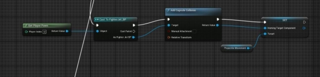

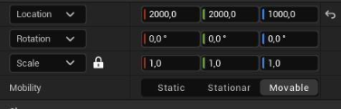

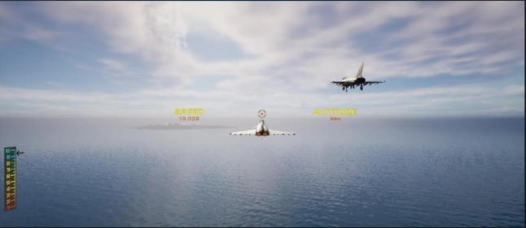

2. **Multiplayer Dogfight**     

In multiplayer mode, players compete in real-time air combat.     

- Each player’s aircraft position, orientation, and firing events are replicated to all clients.     
- Combat is fast-paced, with up to 4 players supported per session.     
3. **Mission Types**     
- **Free Flight**: Explore the environment and get used to controls.     
- **Target Practice**: AI or dummy targets appear for aiming practice.     
- **Dogfight**: Full AI or multiplayer battle with win/loss conditions.     
- **Timed Escape**: Navigate through terrain under time pressure without crashing or being shot down.     

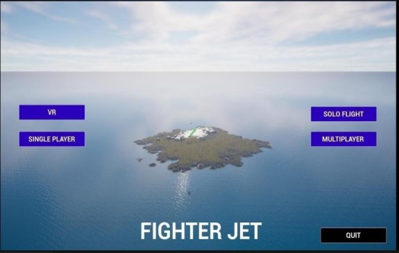

4. **Map & Optimization System**     

Map & Optimization System To support dynamic gameplay, a modular map system was created using Unreal Engine’s Landscape and Terrain tools with focused performance optimization:      

- We initially explored auto-generation techniques, but these produced repetitive and unengaging environments. Instead, two custom-designed islands were created to better suit the needs of a flight simulator.      
- Because large-scale open environments were essential, visual clutter such as trees, flowers, and ground detail meshes were deliberately excluded to avoid unnecessary performance costs.      
- Textures of all map elements were optimized to reduce memory usage and GPU load.      
- The entire level was optimized to run consistently at 120 FPS, a target that was achieved through extensive material and rendering tweaks.     
- Level-of-Detail (LOD) strategies and object culling were applied to distant elements to maintain visual fidelity without sacrificing speed.      
- The absence of boundary triggers was intentional, encouraging a seamless and immersive flying experience with minimal gameplay interruptions.      

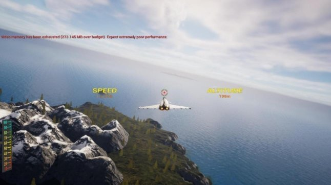

5. **User Interface and Feedback**     
- Custom **cockpit UI** displays real-time values: speed, altitude, pitch, throttle level.     
- Additional UI elements include:     
- Lock-on indicator (for missile firing)  
- Health and ammo indicators     
- Head tracking affects the camera dynamically, making the interface shift based on viewing angle for immersive feedback.     

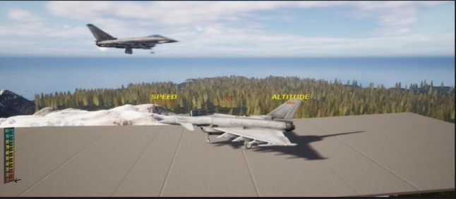

7. **Testing and Evaluation**     
1. **Hardware Communication Testing**   
- **Joystick and Throttle:**   

ESP32-based analog inputs were monitored in real-time using tools such as Arduino Serial Monitor and Python’s pyserial module. We validated:   

- Smooth analog readings across the full range of motion.  o  No signal drops or noise spikes during rapid input shifts.  o   Accurate mapping to aircraft pitch/yaw/roll behavior.   
- **Head Tracking (VR):**   

Using iVRy over USB/Wi-Fi, yaw, pitch, and roll data from the smartphone’s 

IMU were compared to in-game camera behavior. For example, a 90° realworld turn produced a near-exact camera rotation in the cockpit, confirming proper calibration and low-latency data flow.   

2. **Flight Physics Testing**   
- **Response Behavior:**   

Flight input maneuvers were tested with varying strength and duration to observe:   

- Pitch rate under gradual and aggressive input.   
- Roll inertia—noted for smooth banking transitions.   
- Yaw precision during turning and level flight.   
- **Edge Case Testing:**   

`      `By applying sustained max-throttle inputs, we ensured:       

- Acceleration remained within safe boundaries.   
  - Aircraft avoided unnatural behavior like indefinite upward drift or 

velocity overflow.       o Aircraft slowed down properly when throttle was released, validating drag and friction effects.   

3. **AI Behavior Testing**   
- **Tracking and Firing:**   

`             `AI opponents were observed during: o **Chase scenarios:** The AI       

successfully locked onto the player’s collision capsule and followed a stable pursuit path.   

- **Evade simulations**: AI adjusted its route without directly colliding with the player aircraft.   
- **Projectile Behavior:**   

`              `Projectiles fired by AI consistently followed the castTo-based logic, with randomization added to create believable attack patterns. Continuous fire 

at intervals tested for:   

- Frame consistency o Smooth instantiation of projectiles  o o Proper self-destruction timing   
4. **Multiplayer Testing**   
- **Connection Tests:**   

LAN-based multiplayer sessions with 2–3 clients showed stable performance. Each aircraft’s position, throttle status, and projectile firing were replicated with minimal delay.   

- **Replication Reliability:**   

Critical data points—such as destruction events and health states—were 

synchronized using custom-coded replication. Stuttering and prediction errors were minimized using interpolation logic.   

- **Latency Simulation:**   

Intentional latency was introduced (up to 150ms) to simulate real-world 

conditions. The system handled positional desync gracefully, preventing noticeable rubber-banding or misalignment.   

5. **Map & FPS Optimization**  
- **Initial Challenges:**   

  The early procedural map lacked gameplay variability and failed to deliver visual 

  immersion. Performance issues also arose due to large draw calls and inefficient texture handling.   

- **Optimized Custom Map:**   

  A new dual-island terrain was manually designed with low-poly assets and no 

  excessive foliage. Specific improvements included:  o **Texture atlasing** to 

  reduce GPU workload.  o **Mesh instancing** for repeated static objects.   

- **Capped dynamic shadows** to preserve visual fidelity while maintaining 120 FPS          

on mid-range hardware.  

- **Stress Testing:**   

  The map was tested with:   

- Two active players and up to three AI aircraft  o Dynamic projectile activity   
- VR headset rendering in real time   

` `All tests sustained performance above 100–120 FPS without overheating or frame     .                     loss.  

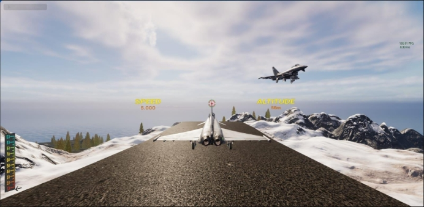

6. **User Feedback**      

   Internal team testing resulted in positive feedback for:    

Smooth joystick responsiveness    

Immersive VR cockpit   

Fluid AI engagement behavior   

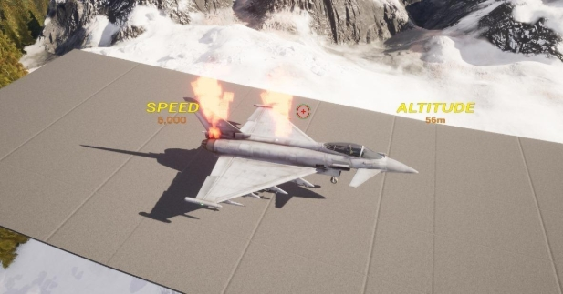

|**Test ID** |**Scenario** |**Expected Result** |**Actual Result** |
| :- | - | - | - |
|T1 |Joystick X/Y movement |Aircraft smoothly pitches and rolls accordingly |Pitch and roll behave smoothly with no input delay |
|T2 |
Throttle 

(potentiometer) input 
|Throttle increases or decreases engine power smoothly |Analog values correctly affect speed; no jitter observed |
|T3 |Head tracking (VR mode) |Cockpit camera follows head movement (yaw/pitch/roll) in real time |Camera rotates in sync with head; minor latency under heavy load |
|T4 |AI fires at player in dogfight |AI fires continuously with randomized spread near player |AI maintains pressure and fires consistently |
|T5 |AI avoids direct collision |AI uses capsule collision to avoid crashing into player |AI loops naturally around player using capsule offset logic |
|T6 |Multiplayer (LAN join) |Clients connect via IP and sync positions/projectiles |Players connected on local, movement & shooting replicated with low latency |
|T7 |VR toggle from main menu |Launches game in stereoscopic view via iVRy |VR launched successfully on smartphone with correct camera split |
|T8 |Solo Flight mode |Player can fly alone with no enemy interaction |Map loads correctly, no enemies spawned |
|T9 |FPS stability under load |Simulation maintains 120 FPS with AI + multiplayer + projectiles |Stable ~115–120 FPS confirmed in stress test |
|T10 |Fire button (spacebar or ESP32 button) |Projectile spawns and moves forward |Firing works on both keyboard and hardware input |
|T11 |“Control” button toggled off |Joystick and throttle inputs are ignored |Inputs correctly disabled; fallback to keyboard/mouse works |
|T12 |Quit button |Game closes and returns to desktop |Exit successful, application shuts down cleanly |

